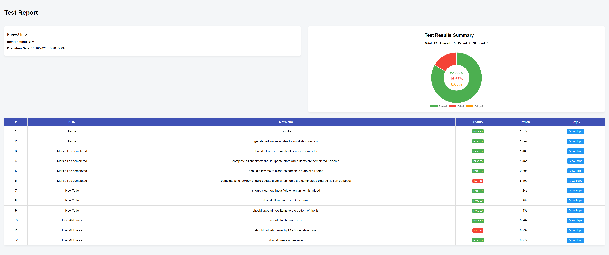
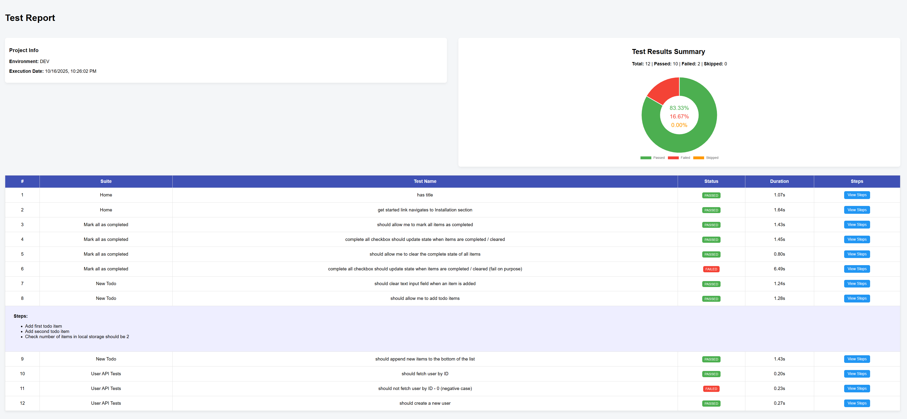
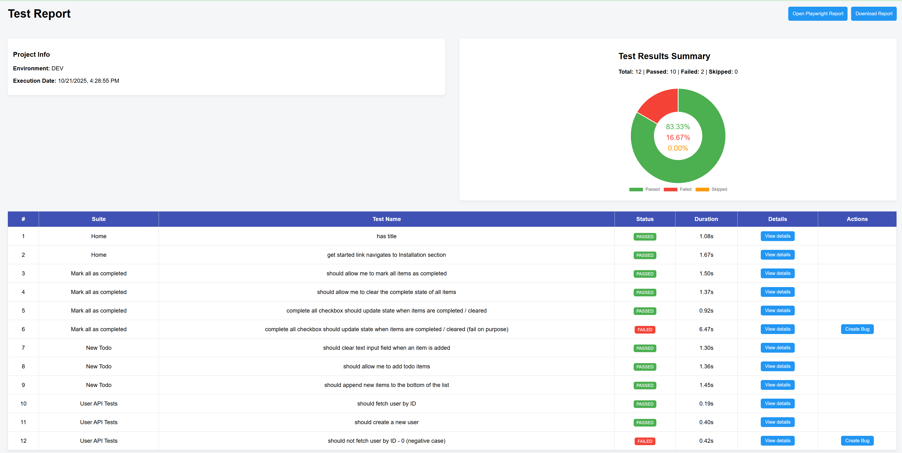

<div align="center">

# AI Agent Playwright + TypeScript Automation Framework Template

Production-ready Playwright test automation starter for teams and startups: strict TypeScript, Page Object Model, environment management, interactive runner, custom HTML reporting (with optional JIRA integration), quality tooling, CI/CD patterns, and agentic (MCP-ready) extensibility.

[Playwright Docs](https://playwright.dev/docs/intro) · [TypeScript](https://www.typescriptlang.org/) · [ESLint](https://eslint.org/) · [Prettier](https://prettier.io/) · [Husky](https://typicode.github.io/husky/)

</div>

---

## Table of Contents

1. [Why This Framework](#why-this-framework)
2. [Features Overview](#features-overview)
3. [Tech Stack](#tech-stack)
4. [Prerequisites](#prerequisites)
5. [Quick Start](#quick-start)
6. [Project Structure](#project-structure)
7. [Environments & Configuration](#environments--configuration)
8. [Running Tests (Scripts)](#running-tests-scripts)
9. [Interactive Custom Test Runner](#interactive-custom-test-runner)
10. [Tagging Strategy](#tagging-strategy)
11. [Page Object Model (POM)](#page-object-model-pom)
12. [Configuration Hub (`configuration.ts`)](#configuration-hub-configurationts)
13. [Custom HTML Reporting](#custom-html-reporting)
14. [Logging](#logging)
15. [Code Quality: Prettier / ESLint / Husky](#code-quality-prettier--eslint--husky)
16. [TypeScript Configuration](#typescript-configuration)
17. [CI/CD Jenkins Pipeline](#cicd-jenkins-pipeline)
18. [Writing & Extending Tests](#writing--extending-tests)
19. [AI Agent & Playwright MCP Integration](#ai-agent--playwright-mcp-integration)
20. [Troubleshooting](#troubleshooting)
21. [Security & Secrets](#security--secrets)
22. [License](#license)

---

## Why This Framework

Instead of spending days wiring up Playwright from scratch, this template gives you:

- Opinionated yet flexible structure - Follows POM design pattern
- Unified configuration & environment variable loading
- A powerful interactive test runner that composes Playwright commands for you
- Rich custom HTML report with JIRA bug creation links & embedded artifacts
- Tag‑driven selective execution (regression, smoke, customer, internal)
- First‑class logging, helper utilities, and mock data
- CI pipeline (Jenkins) example using official Playwright docker image

---

## Features Overview

| Area                  | Capability                                                                                 |
| --------------------- | ------------------------------------------------------------------------------------------ |
| Test Types            | UI, API (E2E slot reserved for future)                                                     |
| Architecture          | Page Object Model for UI/API pages                                                         |
| Environment Handling  | `.env` per environment via `dotenv` + `loadEnv()`                                          |
| Single Config Hub | `utils/configuration.ts` serves as the central config hub that defines environments, browsers, test types, tags, run modes, and JIRA constants to enable custom test execution and seamless JIRA–Jenkins integration.|
| Tagging               | Regression, Smoke, Customer, Internal (via `TAGS` enum)                                    |
| Custom Runner         | Interactive CLI: choose env, browser(s), test type(s), tags, mode (headed / debug / ui) to enable dynamic test execution through interactive prompts.    |
| Reporting             | Playwright built‑in HTML + Custom consolidated HTML (donut chart, steps, JIRA integration) |
| Jenkins dashboard        | Dashboard for details on test execution, integrated with playwright report for more details and `Create bug` option to directly create jira bug with auto-populated details including link to screenshot, videos and traces in the configured project |
| JIRA Hooks            | One‑click “Create Bug” buttons (IDs configurable in `configuration.ts`)   for Jenkins dashboard                  |
| Logging               | File + console logger (`Logger` class) writes to `logs/automation.log`                     |
| CI                    | Jenkins pipeline with Dockerized Playwright execution & HTML publish  + Github actions for code-quality check and running tests                     |
| Code Quality          | Prettier, ESLint, TypeScript strict, Husky + lint‑staged on commit                         |
| Trace Artifacts       | Screenshots, videos & traces retained on failure                                           |
| Agentic Ready | Integrated Playwright MCP and Playwright agents |


---

## Tech Stack

- Playwright Test (`@playwright/test`)
- TypeScript (Strict mode)
- Node.js (LTS recommended)
- Dotenv for environment variable loading
- Inquirer for interactive CLI test runner
- Prettier + ESLint + Husky + lint‑staged for quality gates
- Jenkins (example pipeline) / HTML publisher plugin

---

## Prerequisites

Before you start, ensure the following:

1. **Install Visual Studio Code**
2. **Install Git**
3. **Install Node.js**
   - Download and install Node.js from [here](https://nodejs.org/en/download).
4. **Verify:**
```bash
git --version
node -v
npm -v
```
Optional: VS Code + Playwright extension.

---

## Quick Start

> Windows PowerShell examples (`powershell.exe`)

1. Clone:

```powershell
git clone https://github.com/twinklejoshi/ai-agent-playwright-typescript-template.git
cd ai-agent-playwright-typescript-template
```

2. Install & provision browsers:

```powershell
npm run setup
```

3. (Optional) Create environment files (see below) then run tests:

```powershell
npm run test            # All tests headless, default env=example
npm run test:local      # Explicit local env
```

4. Launch interactive runner:

```powershell
npm run test:custom
```

5. View Playwright report after a run:

```powershell
npm run test:report:playwright
```

6. View custom report:

```powershell
npm run test:report:custom
```

---

## Project Structure

```
├── eslint.config.mjs
├── Jenkinsfile
├── package.json
├── playwright.config.ts
├── tsconfig.json
├── environments/
│   ├── local.env  (add your own)
│   ├── dev.env    (add your own)
│   ├── qa.env     (add your own)
│   └── example.env (sample)
├── utils/                # Cross-cutting utilities outside src
│   ├── configuration.ts  # Central config file for all config (TAGS, browsers, Jira, etc.) in the project 
│   ├── custom-reporter.ts # Custom HTML report generator - generate a simple report and Jenkins dashboard
│   ├── env-loader.ts #Environment loading logic
│   └── run-custom-tests.ts # CLI interactive runner
└── src/
    ├── pages/
    │   ├── ui/           # UI POM classes
    │   └── api/          # API abstraction classes
    ├── shared/
    │   ├── mock-data/    # Test data (e.g., todo items, user prototypes)
    │   ├── types/        # Reusable TS types
    │   └── utils/        # Helpers (logger, local storage checks)
    └── tests/
        ├── ui/           # UI specs & fixtures
        └── api/          # API specs
        └── e2e/          # (Create for end-to-end flows)
```

> Note: Imports like `@utils/configuration` reference root `utils/`. If you add more aliases, update `tsconfig.json` paths accordingly (see [TypeScript Configuration](#typescript-configuration)).

---

## Environments & Configuration

Located under `environments/`. Create one file per target: `local.env`, `dev.env`, `qa.env` (an `example.env` is provided as a fallback reference). Loader implementation (`utils/env-loader.ts`):
```ts
export const loadEnv = (env: string = 'example') => { /* resolves environments/<env>.env via dotenv */ };
```
`playwright.config.ts` calls:
```ts
loadEnv(process.env.NODE_ENV || 'example');
```
Usage pattern:
```bash
npx cross-env NODE_ENV=local playwright test --grep "@smoke"
```
Sample `local.env`:
```env
environment=local
BASE_URL=https://local.example.com
USERNAME=test_user
PASSWORD=test_pass
```
Access with `process.env.BASE_URL`.

If a specified file is missing, adjust the default parameter or create the file to avoid silent misconfiguration.

### Adding New Variables

1. Add to each `<env>.env`
2. Reference anywhere via `process.env.MY_VAR`.
3. For CI Jenkins pipeline, set/inject using credentials bindings (see Jenkinsfile).

---

## Running Tests (Scripts)

| Script                            | Purpose                          |
| --------------------------------- | -------------------------------- |
| `npm run test`                    | All tests headless (default env) |
| `npm run test:local` / `test:dev` | Force specific environment       |
| `npm run test:headed`             | Run in headed browsers           |
| `npm run test:ui`                 | Launch Playwright UI runner      |
| `npm run test:debug`              | Debug mode (slow-mo inspector)   |
| `npm run test:trace`              | Enables trace collection         |
| `npm run test:custom`             | Interactive multi-select runner  |
| `npm run test:report:playwright`  | Open last Playwright HTML report |
| `npm run test:report:custom`      | Open custom consolidated report  |

Artifacts (screenshots, videos, traces) retained only on test failure (`retain-on-failure`).

---

## Interactive Custom Test Runner


```bash
npm run test:custom
```

The `test:custom` command runs the `run-custom-tests.ts` script. The `run-custom-tests.ts` script is an interactive tool for flexible test execution. It allows you to select the environment, browser, test type, test group and test mode. Based on your choices, it dynamically constructs and runs the appropriate Playwright command, simplifying custom test runs without manual configuration changes.

**Usage Example**

To run the custom test flow:

1. Execute the script:
   ```bash
   npm run test:custom
   ```
2. Follow the prompts to select your environment, browser, test type, test group and test mode.
3. The script will execute the selected tests and display the output.

For more details on how the script works, refer to [Custom Test Script: `run-custom-tests.ts`](#custom-test-script-run-custom-testsmjs).


### **Custom Test Script: `run-custom-tests.ts`**

The `run-custom-tests.ts` script enables dynamic test execution through interactive prompts. It allows users to select the following options:

1. **Environment**:
   - Select an environment:
     - `Local`
     - `Dev`
     - `QA`

2. **Browser**:
   - Select the browser:
     - `Chromium`
     - `Firefox`
     - `WebKit`

3. **Test Type**:
   - Specify the type of tests:
     - `API`
     - `UI`
     - `E2E`

4. **Test Group**:
   - Filter tests by tag:
     - `Regression`
     - `Smoke`

5. **Test Mode**:
   - Filter tests by tag:
     - `Headless`
     - `UI`

**Sample Command Generated by Script**
If the user selects:

- Environment: `QA`
- Browser: `Chromium`
- Test Type: `UI`
- Test Group: `Regression`
- TestMode: ` Default => Headless`

The generated command will look like:

```bash
npx cross-env NODE_ENV=local playwright test --project=chromium .src/tests/ui --grep "@regression"
```

The script dynamically builds this command, ensuring flexible and efficient test execution.


---

## Tagging Strategy

Tags are defined in `utils/configuration.ts` enum `TAGS`:

```typescript
export enum TAGS {
	REGRESSION = "@regression",
	SMOKE = "@smoke",
	CUSTOMER = "@customer",
	INTERNAL = "@internal",
}
```

Apply tags per test via metadata:

```typescript
test("create todo", { tag: [TAGS.REGRESSION, TAGS.CUSTOMER] }, async ({ ... }) => { /* ... */ });
```

Filter execution using `--grep "@regression"` or combined with OR using pipes from custom runner.

Add new tags: extend `TAGS`, then insert into `TEST_GROUPS` for interactive selection.

---

## Page Object Model (POM)

The **Page Object Model (POM)** is utilized for organizing UI, API, and end-to-end test files. Each application page or endpoint is represented by a class or module, enabling a clean separation of concerns and improving maintainability.

#### **Core Components:**
1. **Pages**: Represents the application's UI pages or API endpoints. Contains all related elements and actions.
2. **Tests**: Contains test scripts to validate functionality by using methods from the `pages`.
3. **Utils**: Provides shared helpers, mock data, constants, and utilities.

### **Detailed Folder Descriptions**

#### **1. `shared` Folder**
- **Purpose**: Stores shared resources and logic that can be used across all projects.
- **Structure**:
  - **mock-data**: Contains test data which can be used to validate functionalities
    - Example:
      ```Typescript
      export const projectMockData: Project = {
          name: "New Project - Test 1",
          description: "New Project - Description",
          type: "Default",
          group: "new_group",
          coordinates: [],
      };
      ```
  - **types**: Contains types.
    - Example:
      ```Typescript
      export type Project = {
          name: string;
          description: string;
          type: string;
          group: string;
          coordinates: Coordinates[];
      };
      ```
  - **utils**: Provides custom logger, global helper functions or utility scripts, e.g., data formatting methods or mock generators or api utils.
    - custom-logger.ts file contains implementation of logger functionality that helps in recording steps taken to execute each tests.

#### **2. Pages**:
  - `ui`: Contains classes to model individual pages/components and includes methods to interact with page elements (e.g., clicking buttons, entering text, validating UI elements).
    - Example:
      ```Typescript
      class LoginPage {
          async enterUsername(username) { await page.locator('#username').fill(username); }
          async enterPassword(password) { await page.locator('#password').fill(password); }
          async clickLogin() { await page.locator('#loginBtn').click(); }
      }
      ```

  - `api`: Manages API endpoint interactions with reusable methods.
    - Example:
      ```Typescript
      class UserAPI {
          getUser(userId) { /* API call logic */ }
          createUser(data) { /* API call logic */ }
      }
      ```

#### **3. Tests**:
  - `ui`: Contains test scripts for UI components and interactions.
    - Example:
      ```Typescript
      test('login form validation', async () => {
          await loginPage.enterUsername('user');
          await loginPage.enterPassword('');
          await loginPage.clickLogin();
          expect(await loginPage.errorText).toBe('Password is required');
      });
      ```
  - `e2e`: Implements end-to-end testing scenarios to validate workflows.
    - Example:
      ```Typescript
      test('create project', async () => {
          await loginPage.login('user', 'password');
          await projectPage.createProject({ name: 'New Project', type: 'default' });
      });
      ```
  - `api`: Validates API responses, status codes, and workflows.
    - Example:
      ```Typescript
      test('should fetch user details', async () => {
          const user = await userApi.getUser(1);
          expect(user.name).toBe('John Doe');
      });
      ```

### **Details of `Pages` and `Tests`**

**What Pages Will Include:**

- **Web Elements**: Locators for UI elements or endpoints for APIs.
  - Example (for UI): `this.loginButton = page.locator('#loginBtn');`
- **Actions**: Methods for interacting with the elements (e.g., `clickLogin()`, `enterUsername()`).
- **Reusable Functions**: Methods for common tasks like navigation or API requests.

**What Tests Will Include:**

- **Scenario Definitions**: Scripts to validate specific functionalities or workflows.
  - Example: "Verify that the user can log in successfully."
- **Assertions**: Checks to validate expected outcomes.
  - Example: `expect(page.url()).toBe('https://example.com/dashboard');`
- **Setup and Teardown**: Initialization and cleanup code to prepare the test environment. This can be moved to fixtures folder. Fixtures encapsulates setup/teardown, are reusable beween test files and can help with grouping

---

## Configuration Hub (`configuration.ts`)
### Purpose
`utils/configuration.ts` is the canonical source for selectable dimensions of a test run (environment, browser, test type, grouping/tag, execution mode) and external integration constants (JIRA). Centralization avoids script divergence and enables dynamic CLI building.

### Exposed Structures
| Constant | Shape | Usage |
|----------|-------|-------|
| `TAGS` | `enum` | Standard tag values used directly in test metadata (`tag:` field). |
| `ENVIRONMENTS` | `Array<{ name; value }>` | CLI prompt options -> mapped to `NODE_ENV`. |
| `BROWSERS` | `Array<{ name; value }>` | Translated to repeated `--project=<browser>` flags. |
| `TEST_TYPES` | `Array<{ name; value }>` | Builds path segments `.src/tests/<type>` for selective directory runs. |
| `TEST_GROUPS` | `Array<{ name; value }>` | Values come from `TAGS` (used to assemble `--grep`). |
| `MODES` | `Array<{ name; value }>` | Appended to the final command (empty string = default headless). |
| `JIRA_*` constants | Numeric/string placeholders | Consumed by custom reporter to construct create-issue URLs. |

### How the Runner Uses It
In `run-custom-tests.ts` answers from `inquirer` map directly:
```ts
const browserScriptParam = answers.selectedBrowser.map(b => `--project=${b}`).join(' ');
const testTypeParams = answers.selectedTestType.map(t => `.src/tests/${t}`).join(' ');
const testGroupParam = answers.selectedTestGroup.join('|');
```
With these pieces the final command is assembled (mode appended last). This makes adding a new browser or tag a one-line change in `configuration.ts`.

### Adding a New Dimension
1. Add new enum/array entry (e.g., `TAGS.PERFORMANCE = '@performance'`).
2. Extend `TEST_GROUPS` with a `{ name: 'Performance', value: TAGS.PERFORMANCE }` entry.
3. Use tag in test titles or metadata.
4. Rerun `npm run test:custom` – new option appears automatically.

### JIRA Integration Details
Reporter reads IDs/base URL to construct `CreateIssueDetails` link parameters. After providing real IDs:
| Variable | Description | Example |
|----------|-------------|---------|
| `JIRA_PROJECT_ID` | Project numeric ID | `10201` |
| `JIRA_PROJECT_ISSUE_TYPE_ID` | Issue type ID (Bug, Task) | `10004` |
| `JIRA_API_BASE_URL` | Base instance URL | `https://example.atlassian.net` |

Failure rows display a "Create Bug" button which encodes test metadata (steps, attachments paths, error) into the generated link.

### Environment + Path Alias Context
Imports like `import { HomePage } from 'pages/ui';` rely on `tsconfig.json` path mapping (`"*": ["./src/*"]`) enabling shorthand module resolution. This reinforces portability in agent-based code generation (agents can infer domain boundaries from folder names).

---

## Custom HTML Reporting

File: `utils/custom-reporter.ts` implements Playwright Reporter interface:

- Collects test results, steps, durations, artifact paths
- Normalizes failure states
- Generates donut chart (Chart.js) summarizing pass/fail/skipped counts with inline percentages
- Two report modes: simplified (local) & detailed (Jenkins) with JIRA action buttons
- One-click “Create Bug” opens pre-filled JIRA issue creation screen via URL parameters (requires valid `JIRA_PROJECT_ID`, `JIRA_PROJECT_ISSUE_TYPE_ID`, `JIRA_API_BASE_URL` values in `configuration.ts`)
- Provides quick link to underlying Playwright report per test (`detailsPath`)

### Open Reports

```powershell
npm run test:report:playwright   # Native report
npm run test:report:custom       # Custom report
```
### Custom report screenshots



### Jenkins Dashboard


### Configure Output Paths

Set environment variables before run:

```powershell
$env:PLAYWRIGHT_HTML_REPORT_DIR = "reports/playwright-report";
$env:CUSTOM_REPORT_DIR = "reports";
npx playwright test
```

### Jenkins Integration

Pipeline passes Jenkins URLs to reporter so artifact links resolve inside Jenkins UI.

---

## Logging

`src/shared/utils/custom-logger.ts` writes timestamped log lines to console and to `logs/automation.log`.

Methods: `Logger.info | warn | error | debug`

Use inside page objects or helpers for richer step context:

```typescript
Logger.info(`Creating user id=${id}`);
```

Rotate / archive logs by adding a post-run step or integrating with a log collector (future enhancement).

---


## Code Quality: Prettier / ESLint / Husky

### Prettier

Configured with consistent formatting (printWidth 120, tabs enabled, trailing commas). Run:

```powershell
npm run prettier          # Check
npm run prettier:fix      # Auto-fix
```

### ESLint

TypeScript rules + Prettier integration; warnings for unused vars & `any`.

```powershell
npm run eslint
npm run eslint:fix
```

### Husky + lint-staged

`npm run setup` triggers `prepare` script -> installs Husky. On commit, staged JS/TS files are auto formatted & linted (`lint-staged` config in `package.json`).

---

## TypeScript Configuration

Strict settings in `tsconfig.json` ensure type safety. Key options:

- `strict: true`, `noImplicitAny: true`
- `baseUrl: "./"` for simpler non-relative imports
- Current path mapping: `"*": ["./src/*"]` (If you want alias like `@utils/*`, extend:

```json
"paths": {"@utils/*": ["utils/*"], "@shared/*": ["src/shared/*"] }
```

Re-run IDE TS server after changes.

---

## CI/CD Jenkins Pipeline

`Jenkinsfile` shows a Docker-based pipeline using official Playwright image:

1. Clean workspace safely inside ephemeral Alpine container
2. Checkout repo
3. Install dependencies + browsers in Playwright container
4. Inject credentials (URL, USERNAME, PASSWORD) if configured in Jenkins
5. Run tests with environment variables for reporter paths & Jenkins artifact URLs
6. Publish custom HTML report via `publishHTML`

Adjust: `PLAYWRIGHT_IMAGE` version, add parallel stages, archive `reports/`.

### Running Locally in Docker (Example Idea)

```powershell
docker run --rm -v "$PWD":/app -w /app mcr.microsoft.com/playwright:v1.56.0-noble bash -c "npm ci && npx playwright test"
```

---

## Writing & Extending Tests

### Structure

- Place UI specs under `src/tests/ui` and use fixtures for page object provisioning.
- Place API specs under `src/tests/api`.
- Create `src/tests/e2e` for cross-cutting journeys (login + multi-page flows).

### Best Practices

| Practice                            | Rationale                                   |
| ----------------------------------- | ------------------------------------------- |
| Use page object methods             | Avoid selector duplication                  |
| Wrap logical actions in `test.step` | Better reporting & trace readability        |
| Tag tests meaningfully              | Enables selective, faster suites over time  |
| Keep mock data small & realistic    | Easier maintenance, fewer flaky assumptions |
| Avoid sleeps; rely on expectations  | Deterministic & resilient                   |

### Adding E2E

1. Create pages for all involved UI flows
2. Add fixture that logs in / seeds data
3. Write scenario spec & apply `@regression` tag

---

## AI Agent & Playwright MCP Integration

This project is enhanced with AI-driven test assistance through the Model Context Protocol (MCP) and specialized Playwright-focused agents. These agents help you plan test coverage, generate new browser tests, and heal failing tests directly from within a connected MCP client (e.g., VS Code with MCP-enabled assistant).

### What Is MCP?
The **Model Context Protocol (MCP)** is an open protocol that lets AI assistants connect to external tools ("servers") in a secure, structured way. In this project, an MCP server exposes Playwright automation tools so AI agents can:
- Inspect pages
- Generate locators and test code
- Run tests and analyze failures
- Explore application flows for planning test scenarios

### Available AI Agents
Located in `.github/chatmodes/` (planner, generator, healer). Each chatmode document describes when and how to invoke an agent.

1. **Planner Agent (📭 planner.chatmode.md)**
  - Purpose: Explore a live web app and produce structured test scenarios/test plans.
  - Typical Use: Early-stage feature validation or expanding coverage.
  - Capabilities: Page navigation via Playwright MCP tools, enumerating user journeys, grouping by risk & priority.

2. **Generator Agent (📭 generator.chatmode.md)**
  - Purpose: Create Playwright test code from natural language instructions.
  - Typical Use: "Generate a test for the checkout flow" → returns a ready-to-run spec.
  - Capabilities: DOM inspection, locator suggestions, scaffold assertions, optionally re-run test for verification.

3. **Healer Agent (📭 healer.chatmode.md)**
  - Purpose: Debug and fix failing tests by inspecting traces, logs, and page state.
  - Typical Use: "Fix the failing login test" → agent pulls error, adjusts selectors or waits, revalidates.
  - Capabilities: Reads failing test output, proposes patch, can regenerate selectors, suggests retries or waits only when justified.

### How the Integration Works
1. **MCP Configuration**: `.vscode/mcp.json` declares the Playwright MCP server dependency (`"@playwright/mcp@latest"`). When your MCP-enabled assistant starts, it installs/activates this server.
2. **Tool Exposure**: The server exposes actions like opening pages, querying locators, running Playwright commands, and gathering artifacts (screenshots, traces).
3. **Agent Logic**: Each chatmode file provides heuristics so the assistant chooses the correct agent based on your request intent.
4. **Test Lifecycle Tie-In**: Generated or healed tests land in `src/tests/...` following the existing POM patterns.

### Folder & File References
- `.github/chatmodes/` → Agent behavior & examples.
- `.vscode/mcp.json` → Registers MCP servers (Playwright).
- `playwright.config.ts` → Standard Playwright setup; agents align with its projects & settings.
- `src/pages/` & `src/tests/` → Structure agents follow when generating or updating tests.

### Typical Workflows

#### 1. Planning New Coverage
Prompt: "List regression test scenarios for the dashboard at https://app.example.com/dashboard"
Agent Flow:
- Planner navigates to URL
- Enumerates key modules (e.g., charts, filters, export buttons)
- Outputs structured test plan grouped by priority & tags (`@smoke`, `@regression`)

#### 2. Generating a New Test
Prompt: "Create a Playwright test that logs in with user demo@example.com / Pass123 and verifies the avatar displays"
Agent Flow:
- Opens login page via MCP tool
- Captures selectors for email, password, submit, avatar
- Generates a spec file (e.g., `src/tests/ui/login-avatar.spec.ts`) using existing `pages/ui` abstractions if present (or scaffolds minimal inline selectors if not)
- Optionally runs test, returns status and patch if adjustments needed

#### 3. Healing a Failing Test
Prompt: "Fix the failing test in `todo.spec.ts`"
Agent Flow:
- Reads failure stack & screenshot via MCP attachments
- Replays steps, identifies selector mismatch (e.g., `#todo-input` changed to `[data-test="todo-input"]`)
- Suggests patch (or applies if auto-fix mode allowed)
- Re-runs test; if stable, reports fix summary

### Security & Safety Considerations
- Agents operate only on files inside the workspace (no external code injection).
- MCP tool calls are auditable; each action is explicit.
- Test code changes should be reviewed via version control (commit diffs) before merging.

### Extending the Agent System
You can add new specialized agents (e.g., performance profiler) by:
1. Creating a new chatmode file under `.github/chatmodes/` (e.g., `🛠 profiler.chatmode.md`).
2. Defining description, triggers, examples, and allowed MCP tools.
3. (Optional) Adding custom Playwright helpers in `src/shared/utils` to standardize performance metrics.

### Adding Custom MCP Servers
If you need additional context (e.g., Jira, analytics), extend `.vscode/mcp.json` with new servers following the existing JSON schema. Each server can surface APIs the agents can leverage when generating richer reports or logging bugs.

### Benefits
- Faster test authoring from natural language.
- Reduced flakiness via automated healing suggestions.
- Structured planning to avoid coverage gaps.
- Consistent adherence to project POM & naming conventions.

### Troubleshooting
| Issue | Possible Cause | Resolution |
|-------|----------------|-----------|
| Agent doesn't see pages | Page not publicly reachable or auth required | Provide test credentials or open tunnel; ensure login flow described |
| Generated selector unstable | Dynamic attribute chosen | Ask agent to regenerate using data-test attributes or nth-match fallback |
| Healer cannot patch test | Test uses outdated helper abstraction | Refactor page object; re-run healer to map stable locators |
| MCP server not loading | Missing MCP-enabled client | Ensure you are using a tool or extension that supports `.vscode/mcp.json` |

### Quick Start (Conceptual)
1. Open an MCP-enabled chat interface in VS Code.
2. Ask: "Plan tests for the todo feature" → Receive structured plan.
3. Ask: "Generate tests for the highest priority scenarios" → Receive spec files.
4. Run with `npm run test` / `npm run test:custom`.
5. If a test fails, ask: "Heal the failing test in todo.spec.ts".

> NOTE: The AI agent system augments—does not replace—manual test review. Always validate critical path tests before CI integration.

## Extensibility Ideas

- Add GitHub Actions workflow for cross-platform CI
- Integrate Allure or other reporters alongside custom one
- Add visual regression (Playwright screenshot comparisons)
- Implement retries & flake detection dashboards
- Introduce data factories (e.g., `@faker-js/faker`)
- Add parallel sharding & test splitting by tag
- Add API auth token refresh logic in a base class
- Generate accessibility scans (axe-core) as optional tests
- Wire Model Context Protocol (MCP) server to automate prompt usage directly from IDE

---

## Troubleshooting

| Symptom                          | Cause                            | Fix                                                              |
| -------------------------------- | -------------------------------- | ---------------------------------------------------------------- |
| Imports `@utils/...` fail        | Missing tsconfig path mapping    | Extend `paths` in `tsconfig.json`                                |
| Env vars undefined               | Wrong `NODE_ENV` or missing file | Verify `<env>.env` exists & name matches                         |
| Custom report empty              | Reporter not loaded              | Ensure `playwright.config.ts` includes `./utils/custom-reporter` |
| JIRA button opens malformed page | Invalid IDs/Base URL             | Set real values in `configuration.ts`                            |
| Videos/traces missing            | Test passed (only on failure)    | Force failure or set `video: "on"` for debugging                 |
| Husky not running                | Git hooks not installed          | Run `npm run setup` again                                        |

Debug mode:

```powershell
npm run test:debug
```
---

## Security & Secrets

- Keep secrets out of version control—use Jenkins credentials or `.env` files excluded by `.gitignore` (add if missing).
- Never commit real API keys.
- For JIRA integration: store base URL & IDs as env variables or configuration constants with placeholder values.

---

## License

Licensed under ISC (see `LICENSE`). Adapt freely; contributions welcome.

---

## References & Helpful Links

- Playwright Docs: https://playwright.dev/docs/intro
- Test Generator (Codegen): https://playwright.dev/docs/codegen-intro
- VS Code Extension: https://playwright.dev/docs/getting-started-vscode
- ESLint: https://eslint.org/docs/latest/
- TypeScript: https://www.typescriptlang.org/tsconfig

---
